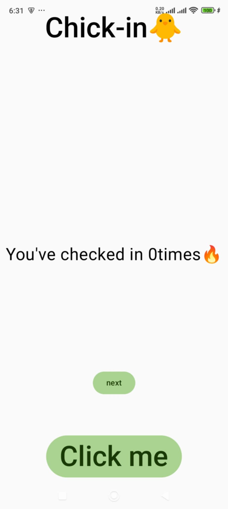
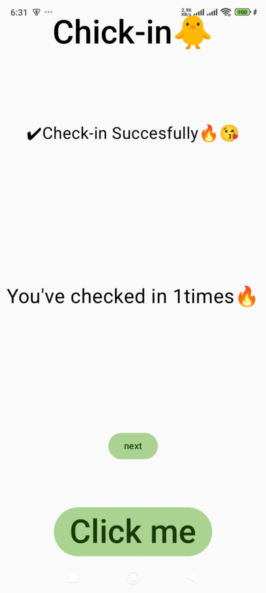
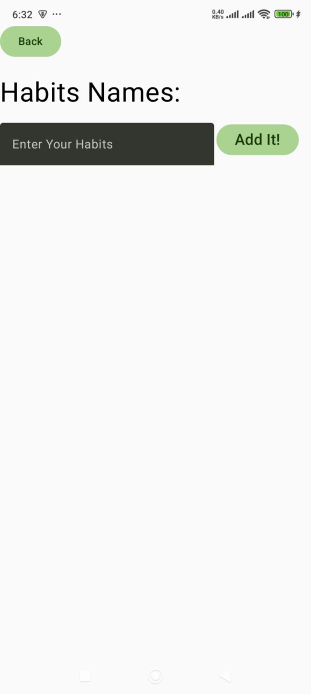
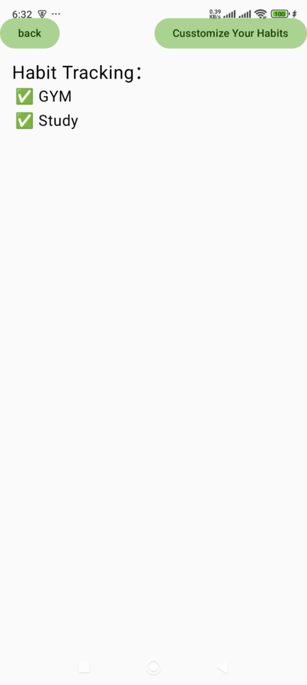

# 🐥 Chick-in

A simple habit check-in app built with **Kotlin** and **Jetpack Compose**.

---

## 📱 Overview

Chick-in is a simple habit tracking app designed as a personal project to practice Kotlin and Jetpack Compose.

It allows users to add custom habits, check in daily by incrementing counts, and view their habit list with a clean multi-screen interface.

The app helps users build and maintain habits by providing an easy-to-use check-in system with immediate visual feedback.

This project serves as a learning tool to explore Android development concepts and state management in Jetpack Compose.

---

## 🔧 Features

- Add custom habits
- Tap to check-in (increment counter)
- View list of habits
- Navigate between pages (Home → Add Habit → View Habits)

---

## 🛠️ Tech Stack

- Kotlin
- Jetpack Compose
- Navigation (NavHost)
- State management with `mutableStateOf` and `mutableStateListOf`

---

## 🚧 Project Status

This is an MVP (Minimum Viable Product) project built for learning purposes.  
No persistent storage or backend has been implemented yet.

---

## 🚀 Getting Started

1. Clone this repository  
2. Open in Android Studio  
3. Run on emulator or physical Android device  

---

## 🙋‍♀️ About Me

This was my first Android project using Kotlin and Jetpack Compose.  
It represents part of my journey to turn real-world needs into working code.  
I'm currently exploring full-stack development and mobile UI/UX design through hands-on projects like this one.

---

## 📱 App Screenshots

### 🏠 Home Page  

### ✅ Check-in Success  

### ➕ Add Habit  

### 📋 Habit List  

---

## 📄 License

This project is licensed under the MIT License - see the [LICENSE](LICENSE) file for details.

---

## 🚀 Roadmap

- Add local data persistence with Room database  
- Implement user authentication and sync  
- Improve UI/UX with animations and themes  
- Add notifications and reminders for habits  

---

## 🤝 Contributing

Contributions are welcome! Please open an issue or submit a pull request.

---

## 📫 Contact

Feel free to reach out: noyolosia@gmail.com
